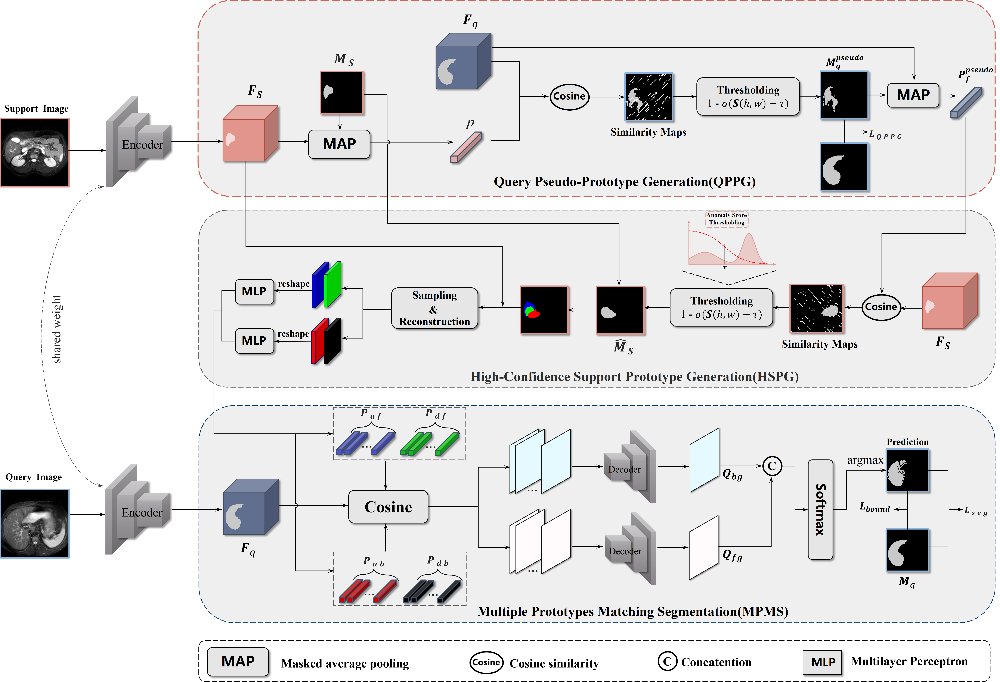

# Abstract
While deep learning has achieved significant progress in medical image segmentation, its reliance on
large-scale annotated data remains a major bottleneck in limited-sample scenarios. Few-shot medical
image segmentation (FSMIS) aims to address this challenge by enabling effective segmentation under
data-scarce conditions. However, existing prototype-based methods typically generate prototypes
from support features via random sampling or local averaging, thereby overlooking the query-specific
demands. To this end, we propose ReLiFSS (Reliability-Aware Few-Shot Medical Image Segmentation),
a query-feature-guided method. Its core idea is to directly integrate query features into the prototype
generation process to construct customized prototypes tailored to different query images. Specifically,
we design a Query Pseudo-Prototype Generation (QPPG) module, which constructs an initial prototype
using support features and performs preliminary segmentation on the query image to extract a pseudoprototype reflecting its specific requirements. Subsequently, the High-Confidence Support Prototype
Generation (HSPG) module utilizes this pseudo-prototype to reverse-segment the support set, mining
the feature regions discriminative for the query image segmentation. Finally, the Multiple Prototypes
Matching Segmentation (MPMS) module fuses foreground and background information via a dualpathway mechanism, helping alleviate foreground-background imbalance. Extensive experiments on
three public medical image datasets show that our method achieves competitive performance compared
with recent FSMIS methods.
